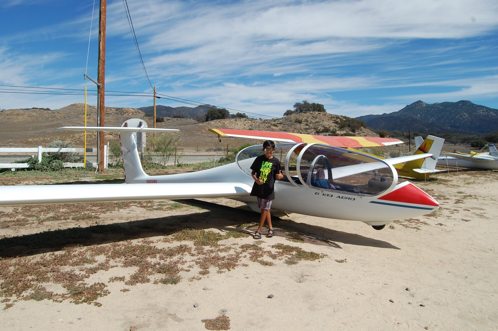

My name is Vignesh (aka CaptMD-11) and I’m an aviation enthusiast. I am mostly into commercial aviation, and I am a fan of trijet airliners (primarily those produced by McDonnell Douglas). 

As many aviation geeks have their favorite aircraft manufacturer, mine has to be McDonnell Douglas. I have always liked their aircraft, since they all have an elegant touch to them. I especially admire the DC-10 and MD-11, since they are such iconic aircraft, and the shapes of their noses and cockpit windows are so aesthetically pleasing to the eye. 

The first aircraft I piloted was a glider in Warner Springs, California, United States, in 2015. It was a very exciting experience, since I had the opportunity of flying the airplane during takeoff and the time spent in the air. I flew the G 103 Acro, and it was a fantastic plane to fly. It truly opened my eyes to how thrilling aviation can be! 

<i>Me next to the Glider I Flew</i>

 

I also fly (virtually) in the X-Plane 11 flight simulator, and I am active on the X-Plane.org forums, working on a project here and there. One of my latest projects includes developing an MD-10-10 for X-Plane 11 with a team of collaborators. 

In addition, I love math and statistics. I find calculus to be one of the most beautiful & useful parts of mathematics. Theoretical statistics also fascinates me, as I enjoy researching the subject - trying to describe natural phenomena through statistical methods. 

Carnatic music also interests me greatly. I can play the violin and mridangam, and have performed a few concerts over the past few years. 

Here is a link to my <a href="https://www.facebook.com/NydhruvaMusic">Facebook page</a>

Here is a link to my <a href="https://www.youtube.com/user/nydhruvas">YouTube channel</a>

Also, here are the links to my friends' blogs, <a href="https://seanboe.github.io/blog/">Sean Boerhout</a> and <a href="https://blog.shad0w.ml">Ayush Nayak</a>, if you would like to check theirs out too! 